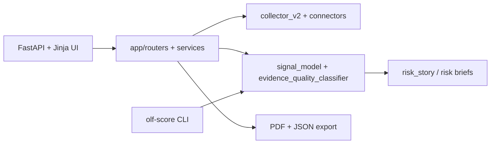

# Operational Leverage Framework Overview

## Purpose
This project models public exposure signals and turns them into structured, evidence-first risk narratives for defensive decision support.

Disclaimer:
- Educational/research software.
- Not a security product.
- No guarantees on outcome quality.

## Architecture

## Main outputs
- Assessment state and evidence logs in SQLite.
- Structured risks with confidence metadata.
- Exported PDF and JSON artifacts for stakeholder communication.

## Operational behavior
- One-command local startup (Windows/Linux/macOS): `python scripts/run.py web`.
- The runner opens `http://127.0.0.1:56461` after the app is reachable (unless `--no-browser` is set).

## Limits and assumptions
- Confidence is heuristic and evidence-dependent.
- Public-source visibility is incomplete by definition.
- Optional API-based connectors may be skipped when keys are not configured.
